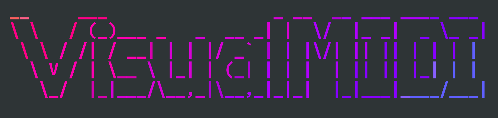
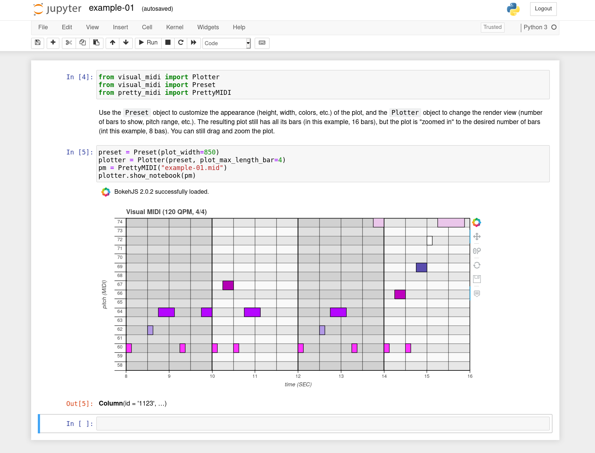

# Visual MIDI

[](https://pypi.org/project/Visual-MIDI/1.1.0/)

Converts a [pretty midi](https://craffel.github.io/pretty-midi/) sequence to a [bokeh plot](https://bokeh.pydata.org/en/latest/). See [https://pypi.org/project/Visual-MIDI/](https://pypi.org/project/Visual-MIDI/).

<p align="center">
  
</p>

## Installation

```bash
pip install visual_midi
```

## Compatibility

Might work with older versions but wasn't tested:

- Python 3 (>= 3.6)
- pretty_midi >= 0.2.8
- bokeh >= 2.0.2

## Usage

Use the `Preset` object to customize the appearance (height, width, colors, etc.) of the plot, and the `Plotter` object to change the render view (number of bars to show, pitch range, etc.). The resulting plot still has all its bars (in this example, 16 bars), but the plot is "zoomed in" to the desired number of bars (int this example, 8 bas). You can still drag and zoom the plot.

- `Plotter#save` - Saves the pretty midi object as a plot file (html) in the provided file
- `Plotter#show` - Shows the pretty midi object as a plot file (html) in the browser
- `Plotter#show_notebook` - Shows the pretty midi object as a plot file in the notebook

### Python

Can show a plot from a MIDI file on disk, or from any PrettyMIDI object, including coming from libraries such as Magenta (like [Magenta note-seq](https://github.com/magenta/note-seq)).

```python
from visual_midi import Plotter
from visual_midi import Preset
from pretty_midi import PrettyMIDI

# Loading a file on disk using PrettyMidi, and show
pm = PrettyMIDI("docs/example-01.mid")
plotter = Plotter()
plotter.show(pm, "/tmp/example-01.html")

# Converting to PrettyMidi from another library, like Magenta note-seq
import magenta.music as mm
pm = mm.midi_io.note_sequence_to_pretty_midi(sequence)
plotter = Plotter()
plotter.show(pm, "/tmp/example-02.html")
```


```python
from visual_midi import Plotter
from visual_midi import Preset
from pretty_midi import PrettyMIDI

# Using the `Preset` and `Plotter` to customize appearance (smaller plot)
pm = PrettyMIDI("docs/example-01.mid")
preset = Preset(plot_width=850)
plotter = Plotter(preset, plot_max_length_bar=4)
plotter.show(pm, "/tmp/example-01.html")
```

### Notebooks

See [example Jupyter notebook](./docs/example-01.ipynb):

```python
from visual_midi import Plotter
from visual_midi import Preset
from pretty_midi import PrettyMIDI

preset = Preset(plot_width=850)
plotter = Plotter(preset, plot_max_length_bar=4)
pm = PrettyMIDI("docs/example-01.mid")
plotter.show_notebook(pm)
```



### Command line

```bash
visual_midi "midi_file_01.mid" "midi_file_02.mid"
```

### Flags

The same flags can be used both in Python and on the command line.

```bash
visual_midi -h
usage: visual_midi [-h] [--qpm QPM]
                   [--plot_pitch_range_start PLOT_PITCH_RANGE_START]
                   [--plot_pitch_range_stop PLOT_PITCH_RANGE_STOP]
                   [--plot_bar_range_start PLOT_BAR_RANGE_START]
                   [--plot_bar_range_stop PLOT_BAR_RANGE_STOP]
                   [--plot_max_length_bar PLOT_MAX_LENGTH_BAR]
                   [--plot_title PLOT_TITLE]
                   [--bar_fill_alphas BAR_FILL_ALPHAS] [--coloring COLORING]
                   [--show_velocity SHOW_VELOCITY]
                   [--midi_time_signature MIDI_TIME_SIGNATURE]
                   [--live_reload LIVE_RELOAD] [--plot_width PLOT_WIDTH]
                   [--plot_height PLOT_HEIGHT] [--row_height ROW_HEIGHT]
                   [--show_bar SHOW_BAR] [--show_beat SHOW_BEAT]
                   [--title_text_font_size TITLE_TEXT_FONT_SIZE]
                   [--axis_label_text_font_size AXIS_LABEL_TEXT_FONT_SIZE]
                   [--axis_x_major_tick_out AXIS_X_MAJOR_TICK_OUT]
                   [--axis_y_major_tick_out AXIS_Y_MAJOR_TICK_OUT]
                   [--label_y_axis_offset_x LABEL_Y_AXIS_OFFSET_X]
                   [--label_y_axis_offset_y LABEL_Y_AXIS_OFFSET_Y]
                   [--axis_y_label_standoff AXIS_Y_LABEL_STANDOFF]
                   [--label_text_font_size LABEL_TEXT_FONT_SIZE]
                   [--label_text_font_style LABEL_TEXT_FONT_STYLE]
                   [--toolbar_location TOOLBAR_LOCATION]
                   [--stop_live_reload_button STOP_LIVE_RELOAD_BUTTON]
                   files [files ...]

positional arguments:
  files

optional arguments:
  -h, --help            show this help message and exit
  --qpm QPM
  --plot_pitch_range_start PLOT_PITCH_RANGE_START
  --plot_pitch_range_stop PLOT_PITCH_RANGE_STOP
  --plot_bar_range_start PLOT_BAR_RANGE_START
  --plot_bar_range_stop PLOT_BAR_RANGE_STOP
  --plot_max_length_bar PLOT_MAX_LENGTH_BAR
  --plot_title PLOT_TITLE
  --bar_fill_alphas BAR_FILL_ALPHAS
  --coloring COLORING
  --show_velocity SHOW_VELOCITY
  --midi_time_signature MIDI_TIME_SIGNATURE
  --live_reload LIVE_RELOAD
  --plot_width PLOT_WIDTH
  --plot_height PLOT_HEIGHT
  --row_height ROW_HEIGHT
  --show_bar SHOW_BAR
  --show_beat SHOW_BEAT
  --title_text_font_size TITLE_TEXT_FONT_SIZE
  --axis_label_text_font_size AXIS_LABEL_TEXT_FONT_SIZE
  --axis_x_major_tick_out AXIS_X_MAJOR_TICK_OUT
  --axis_y_major_tick_out AXIS_Y_MAJOR_TICK_OUT
  --label_y_axis_offset_x LABEL_Y_AXIS_OFFSET_X
  --label_y_axis_offset_y LABEL_Y_AXIS_OFFSET_Y
  --axis_y_label_standoff AXIS_Y_LABEL_STANDOFF
  --label_text_font_size LABEL_TEXT_FONT_SIZE
  --label_text_font_style LABEL_TEXT_FONT_STYLE
  --toolbar_location TOOLBAR_LOCATION
  --stop_live_reload_button STOP_LIVE_RELOAD_BUTTON
```

## Contributing

### Development

Installing dependencies with:

```bash
pip install -r requirements.txt
```

Then modify the code and install Visual MIDI:

```bash
# Installs the library, dependencies, and command line scripts
python setup.py install

# Installs the python library (necessary for python imports)
python setup.py install_lib
```

### Guidelines

Use this [code style](config/visual-midi-code-style-intellij.xml).

## TODO

See [TODO](TODO.md).

## License

See [MIT License](LICENSE).
