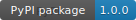
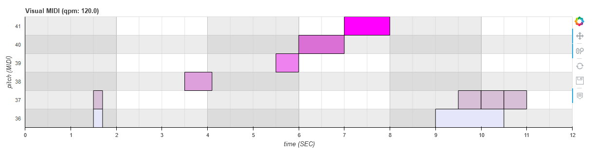

# Visual MIDI

[](https://pypi.org/project/Visual-MIDI/1.0.0/)

Converts a [pretty midi](https://craffel.github.io/pretty-midi/) sequence to a [bokeh plot](https://bokeh.pydata.org/en/latest/). See [https://pypi.org/project/Visual-MIDI/](https://pypi.org/project/Visual-MIDI/).

## Installation

```bash
pip install visual_midi
```

## Usage

### Python

```python
from visual_midi import Plotter
from pretty_midi import PrettyMIDI

pm = PrettyMIDI("docs/example-01.mid")
plotter = Plotter()
plotter.show(pm, "docs/example-01.html")
```



### Command line

```bash
visual_midi "midi_file_01.mid" "midi_file_02.mid"
```

### Flags

The same flags can be used both in Python and on the command line.

```bash
visual_midi -h
usage: visual_midi [-h] [--qpm QPM]
                   [--plot_pitch_range_start PLOT_PITCH_RANGE_START]
                   [--plot_pitch_range_stop PLOT_PITCH_RANGE_STOP]
                   [--plot_bar_range_start PLOT_BAR_RANGE_START]
                   [--plot_bar_range_stop PLOT_BAR_RANGE_STOP]
                   [--plot_max_length_bar PLOT_MAX_LENGTH_BAR]
                   [--bar_fill_alphas BAR_FILL_ALPHAS] [--coloring COLORING]
                   [--show_velocity SHOW_VELOCITY]
                   [--midi_time_signature MIDI_TIME_SIGNATURE]
                   [--live_reload LIVE_RELOAD] [--plot_width PLOT_WIDTH]
                   [--plot_height PLOT_HEIGHT] [--row_height ROW_HEIGHT]
                   [--show_bar SHOW_BAR] [--show_beat SHOW_BEAT]
                   [--title_text_font_size TITLE_TEXT_FONT_SIZE]
                   [--axis_label_text_font_size AXIS_LABEL_TEXT_FONT_SIZE]
                   [--axis_x_major_tick_out AXIS_X_MAJOR_TICK_OUT]
                   [--axis_y_major_tick_out AXIS_Y_MAJOR_TICK_OUT]
                   [--label_y_axis_offset_x LABEL_Y_AXIS_OFFSET_X]
                   [--label_y_axis_offset_y LABEL_Y_AXIS_OFFSET_Y]
                   [--axis_y_label_standoff AXIS_Y_LABEL_STANDOFF]
                   [--label_text_font_size LABEL_TEXT_FONT_SIZE]
                   [--label_text_font_style LABEL_TEXT_FONT_STYLE]
                   [--toolbar_location TOOLBAR_LOCATION]
                   [--stop_live_reload_button STOP_LIVE_RELOAD_BUTTON]
                   files [files ...]

positional arguments:
  files

optional arguments:
  -h, --help            show this help message and exit
  --qpm QPM
  --plot_pitch_range_start PLOT_PITCH_RANGE_START
  --plot_pitch_range_stop PLOT_PITCH_RANGE_STOP
  --plot_bar_range_start PLOT_BAR_RANGE_START
  --plot_bar_range_stop PLOT_BAR_RANGE_STOP
  --plot_max_length_bar PLOT_MAX_LENGTH_BAR
  --bar_fill_alphas BAR_FILL_ALPHAS
  --coloring COLORING
  --show_velocity SHOW_VELOCITY
  --midi_time_signature MIDI_TIME_SIGNATURE
  --live_reload LIVE_RELOAD
  --plot_width PLOT_WIDTH
  --plot_height PLOT_HEIGHT
  --row_height ROW_HEIGHT
  --show_bar SHOW_BAR
  --show_beat SHOW_BEAT
  --title_text_font_size TITLE_TEXT_FONT_SIZE
  --axis_label_text_font_size AXIS_LABEL_TEXT_FONT_SIZE
  --axis_x_major_tick_out AXIS_X_MAJOR_TICK_OUT
  --axis_y_major_tick_out AXIS_Y_MAJOR_TICK_OUT
  --label_y_axis_offset_x LABEL_Y_AXIS_OFFSET_X
  --label_y_axis_offset_y LABEL_Y_AXIS_OFFSET_Y
  --axis_y_label_standoff AXIS_Y_LABEL_STANDOFF
  --label_text_font_size LABEL_TEXT_FONT_SIZE
  --label_text_font_style LABEL_TEXT_FONT_STYLE
  --toolbar_location TOOLBAR_LOCATION
  --stop_live_reload_button STOP_LIVE_RELOAD_BUTTON
```

## Contributing

### Development

```bash
# Installs the library, dependencies, and command line scripts
python setup.py install

# Installs the python library (necessary for python imports)
python setup.py install_lib
```

### Guidelines

Use this [code style](config/visual-midi-code-style-intellij.xml).

## TODO

See [TODO](TODO.md).

## License

See [MIT License](LICENSE).
